---
## Front matter
title: "Отчёт по лабораторной работе 5"
subtitle: "дисциплина: Архитектура компьютера"
author: "Тяпкова Альбина НММбд-04-24"

## Generic otions
lang: ru-RU
toc-title: "Содержание"

## Bibliography
bibliography: bib/cite.bib
csl: pandoc/csl/gost-r-7-0-5-2008-numeric.csl

## Pdf output format
toc: true # Table of contents
toc-depth: 2
lof: true # List of figures
lot: true # List of tables
fontsize: 12pt
linestretch: 1.5
papersize: a4
documentclass: scrreprt
## I18n polyglossia
polyglossia-lang:
  name: russian
  options:
	- spelling=modern
	- babelshorthands=true
polyglossia-otherlangs:
  name: english
## I18n babel
babel-lang: russian
babel-otherlangs: english
## Fonts
mainfont: PT Serif
romanfont: PT Serif
sansfont: PT Sans
monofont: PT Mono
mainfontoptions: Ligatures=TeX
romanfontoptions: Ligatures=TeX
sansfontoptions: Ligatures=TeX,Scale=MatchLowercase
monofontoptions: Scale=MatchLowercase,Scale=0.9
## Biblatex
biblatex: true
biblio-style: "gost-numeric"
biblatexoptions:
  - parentracker=true
  - backend=biber
  - hyperref=auto
  - language=auto
  - autolang=other*
  - citestyle=gost-numeric
## Pandoc-crossref LaTeX customization
figureTitle: "Рис."
tableTitle: "Таблица"
listingTitle: "Листинг"
lofTitle: "Список иллюстраций"
lotTitle: "Список таблиц"
lolTitle: "Листинги"
## Misc options
indent: true
header-includes:
  - \usepackage{indentfirst}
  - \usepackage{float} # keep figures where there are in the text
  - \floatplacement{figure}{H} # keep figures where there are in the text
---

# Цель работы

Целью работы является приобретение практических навыков работы в Midnight Commander, а также освоение инструкций языка ассемблера `mov` и `int`.

# Выполнение лабораторной работы

## Знакомство с Midnight Commander

Я открыла Midnight Commander и с помощью клавиш со стрелками и Enter перешла в каталог `~/work/arch-pc`. Затем нажала `F7` и создала каталог `lab05`.

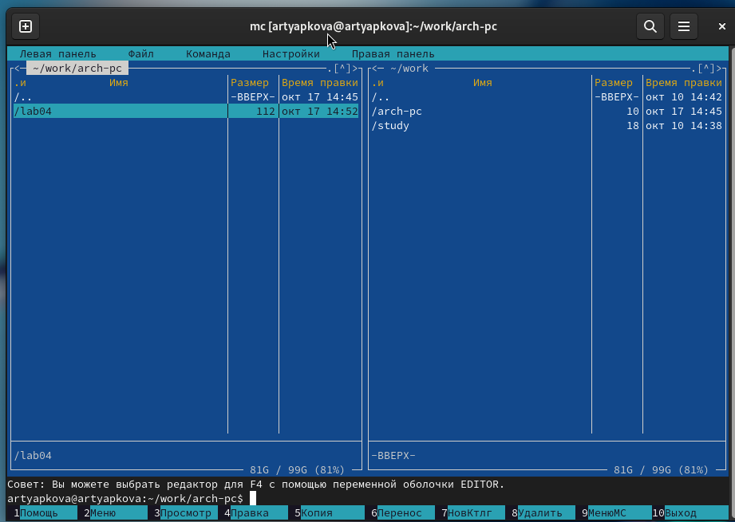{ #fig:001 width=70%, height=70% }

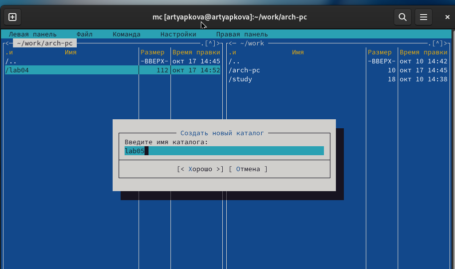{ #fig:002 width=70%, height=70% }

При помощи команды `touch` я создала файл `lab05-1.asm`.

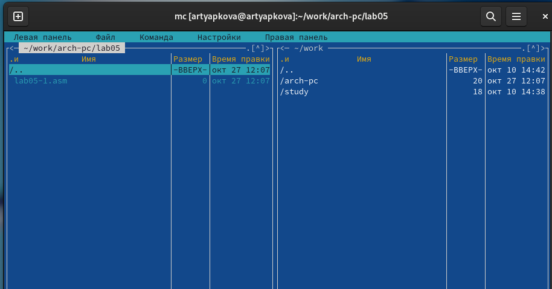{ #fig:003 width=70%, height=70% }

Открыла файл на редактирование, нажав `F4`, выбрала редактор `mceditor` и написала код программы из задания.

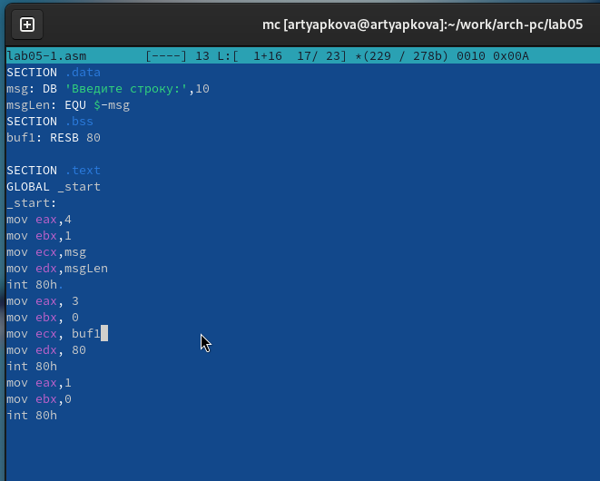{ #fig:004 width=70%, height=70% }

Открыла файл для просмотра, нажав `F3`, и убедилась, что он содержит написанный код.

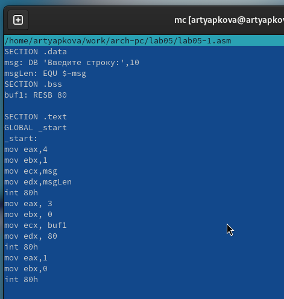{ #fig:005 width=70%, height=70% }

Я транслировала файл программы в объектный файл, выполнила компоновку объектного файла и получила исполняемый файл программы, проверив ее работу.

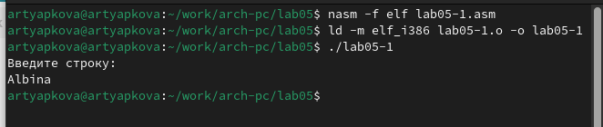{ #fig:006 width=70%, height=70% }

## Подключение внешнего файла in_out.asm

Для упрощения написания программ часто встречающиеся одинаковые участки кода, такие как вывод строки на экран или выход из программы, можно оформить в виде подпрограмм и сохранить в отдельные файлы. Это позволяет сделать основную программу более удобной для написания и чтения.

Для выполнения лабораторных работ используется файл `in_out.asm`, который содержит следующие подпрограммы:

* `slen` – вычисление длины строки (используется в подпрограммах печати сообщения для определения количества выводимых байтов);
* `sprint` – вывод сообщения на экран. Перед вызовом `sprint` в регистр `eax` необходимо записать выводимое сообщение (`mov eax, <message>`);
* `sprintLF` – работает аналогично `sprint`, но при выводе на экран добавляет к сообщению символ перевода строки;
* `sread` – ввод сообщения с клавиатуры. Перед вызовом `sread` в регистр `eax` необходимо записать адрес переменной, в которую введенное сообщение будет записано (`mov eax, <buffer>`), в регистр `ebx` – длину вводимой строки (`mov ebx, <N>`);
* `iprint` – вывод на экран чисел в формате ASCII. Перед вызовом `iprint` в регистр `eax` необходимо записать выводимое число (`mov eax, <int>`);
* `iprintLF` – работает аналогично `iprint`, но при выводе на экран после числа добавляет символ перевода строки;
* `atoi` – функция преобразует ASCII-код символа в целое число и записывает результат в регистр `eax`. Перед вызовом `atoi` в регистр `eax` необходимо записать число (`mov eax, <int>`);
* `quit` – завершение программы.

Я скачала файл `in_out.asm` и разместила его в рабочем каталоге. Для копирования использовала клавишу `F5`, а для перемещения – клавишу `F6`.

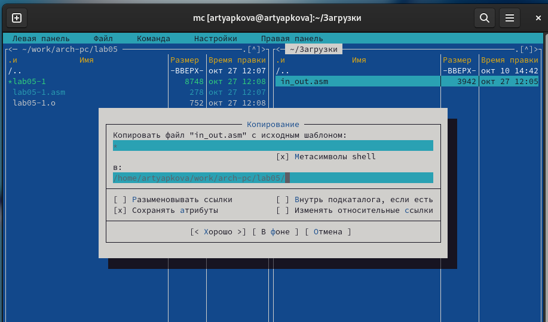{ #fig:007 width=70%, height=70% }

Я скопировала `lab05-1.asm` в `lab05-2.asm`.

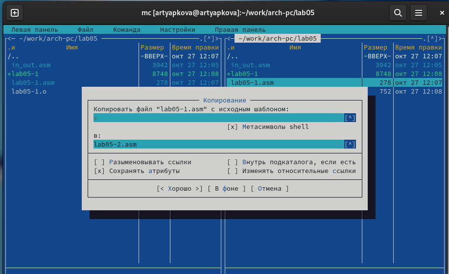{ #fig:008 width=70%, height=70% }

Написала код программы `lab05-2.asm`, используя подпрограммы из внешнего файла `in_out.asm`. Скомпилировала программу и проверила запуск.

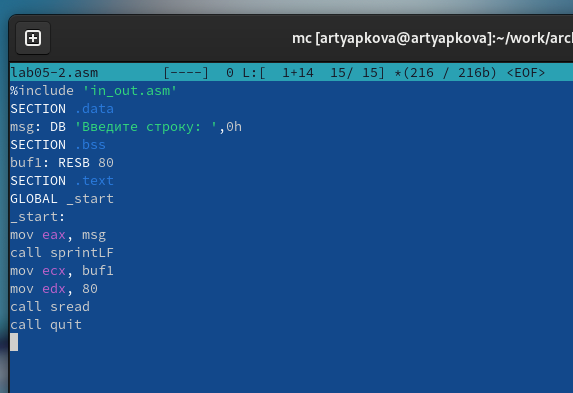{ #fig:009 width=70%, height=70% }

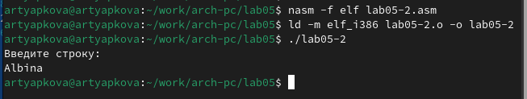{ #fig:010 width=70%, height=70% }

В файле `lab05-2.asm` я заменила подпрограмму `sprintLF` на `sprint`. Заново собрала исполняемый файл. Теперь после вывода строки она не завершается символом перехода на новую строку.

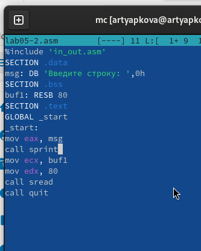{ #fig:011 width=70%, height=70% }

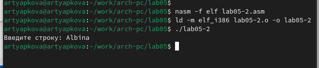{ #fig:012 width=70%, height=70% }

## Задание для самостоятельной работы

Я скопировала программу `lab05-1.asm` и изменила код, так чтобы она работала по следующему алгоритму:

* вывести приглашение типа “Введите строку:”;
* ввести строку с клавиатуры;
* вывести введённую строку на экран.

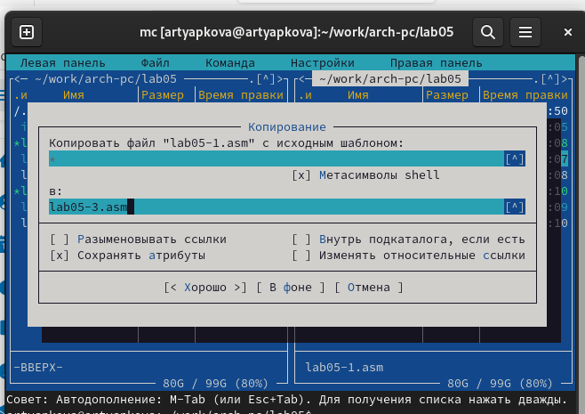{ #fig:013 width=70%, height=70% }

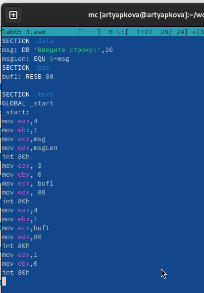{ #fig:014 width=70%, height=70% }

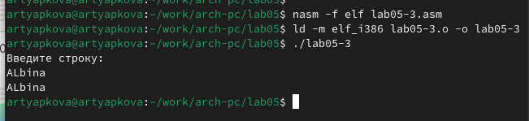{ #fig:015 width=70%, height=70% }

Аналогично я скопировала программу `lab05-2.asm` и изменила код, но теперь использовала подпрограммы из файла `in_out.asm`.

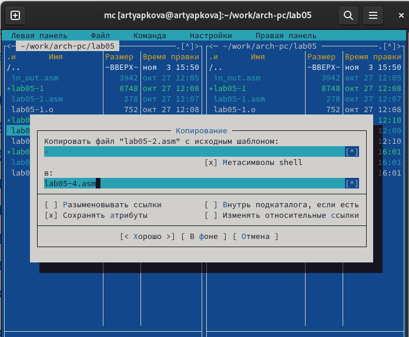{ #fig:016 width=70%, height=70% }

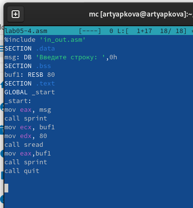{ #fig:017 width=70%, height=70% }

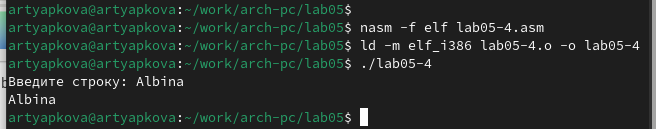{ #fig:018 width=70%, height=70% }

# Выводы

Я научилась писать базовые ассемблерные программы и освоила ассемблерные инструкции `mov` и `int`.
