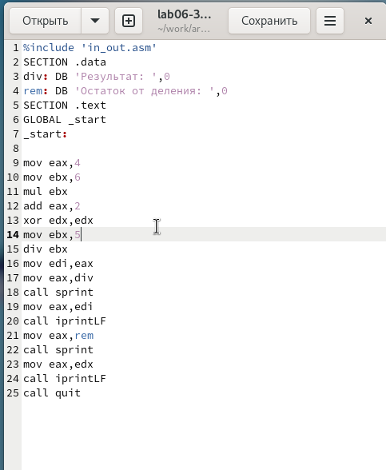

---
## Front matter
title: "Отчёт по лабораторной работе 6"
subtitle: "дисциплина: Архитектура компьютера"
author: "Тяпкова Альбина НММбд-04-24"

## Generic otions
lang: ru-RU
toc-title: "Содержание"

## Bibliography
bibliography: bib/cite.bib
csl: pandoc/csl/gost-r-7-0-5-2008-numeric.csl

## Pdf output format
toc: true # Table of contents
toc-depth: 2
lof: true # List of figures
lot: true # List of tables
fontsize: 12pt
linestretch: 1.5
papersize: a4
documentclass: scrreprt
## I18n polyglossia
polyglossia-lang:
  name: russian
  options:
	- spelling=modern
	- babelshorthands=true
polyglossia-otherlangs:
  name: english
## I18n babel
babel-lang: russian
babel-otherlangs: english
## Fonts
mainfont: PT Serif
romanfont: PT Serif
sansfont: PT Sans
monofont: PT Mono
mainfontoptions: Ligatures=TeX
romanfontoptions: Ligatures=TeX
sansfontoptions: Ligatures=TeX,Scale=MatchLowercase
monofontoptions: Scale=MatchLowercase,Scale=0.9
## Biblatex
biblatex: true
biblio-style: "gost-numeric"
biblatexoptions:
  - parentracker=true
  - backend=biber
  - hyperref=auto
  - language=auto
  - autolang=other*
  - citestyle=gost-numeric
## Pandoc-crossref LaTeX customization
figureTitle: "Рис."
tableTitle: "Таблица"
listingTitle: "Листинг"
lofTitle: "Список иллюстраций"
lotTitle: "Список таблиц"
lolTitle: "Листинги"
## Misc options
indent: true
header-includes:
  - \usepackage{indentfirst}
  - \usepackage{float} # keep figures where there are in the text
  - \floatplacement{figure}{H} # keep figures where there are in the text
---

# Цель работы

Целью работы является освоение арифметических инструкций языка ассемблера NASM.

# Выполнение лабораторной работы

## Символьные и численные данные в NASM

Создала папку для лабораторной работы №6, перешла в неё и создала файл `lab6-1.asm`.

Давайте посмотрим примеры программ, которые выводят символы и числа. Они выводят значения из регистра `eax`.

В программе записываем символ `6` в регистр `eax` (с помощью `mov eax, '6'`), а символ `4` — в `ebx` (`mov ebx, '4'`). Сложим `eax` и `ebx` (командой `add eax, ebx`, результат окажется в `eax`) и выведем его. Так как для `sprintLF` в `eax` нужен адрес, создаём переменную: сохраняем значение `eax` в `buf1`, записываем адрес `buf1` в `eax` и вызываем `sprintLF`.

{ width=70% }

{ width=70% }

Мы ожидаем увидеть число `10`, но вместо этого получаем символ `j`. Это потому, что `add eax, ebx` сложил коды символов `6` и `4` (106, что соответствует `j`).

Теперь изменяю программу, чтобы в регистрах были числа, а не символы.

{ width=70% }

{ width=70% }

Теперь результатом будет символ с кодом `10`, который обозначает конец строки и выводит пустую строку.

В `in_out.asm` есть подпрограммы для преобразования ASCII-символов в числа. Применяю их в новой версии программы.

{ width=70% }

{ width=70% }

В итоге программа выдаёт число `106`, так как `add` складывает коды символов. Функция `iprintLF` выводит число, а не символ.

Аналогично, заменяю символы на числа.

{ width=70% }

Теперь `iprintLF` выводит число `10`, так как операндами были числа, а не символы.

{ width=70% }

Меняю `iprintLF` на `iprint`, собираю и запускаю файл. Результат выводится без переноса строки.

{ width=70% }

## Выполнение арифметических операций в NASM

Рассмотрим программу для выражения $$f(x) = (5 * 2 + 3) / 3$$.

{ width=70% }

{ width=70% }

Изменяю программу для вычисления $$f(x) = (4 * 6 + 2) / 5$$, собираю и запускаю.

{ width=70% }

{ width=70% }

Также есть программа для вычисления значения по номеру студенческого билета.

Ввод производится с клавиатуры в символьном виде и преобразуется в число с помощью `atoi` из `in_out.asm`.

{ width=70% }

{ width=70% }

### Ответы на вопросы

1. Какие строки отвечают за вывод сообщения ‘Ваш вариант’?

   - `mov eax, rem` — значение переменной с фразой ‘Ваш вариант’ переносится в регистр.
   - `call sprint` — вывод сообщения.

2. Для чего используются инструкции?

	- `mov ecx, x`
	- `mov edx, 80`
	- `call sread`

	> Они считывают номер студенческого билета в переменную `x`.

3. Для чего используется `call atoi`?

   > Преобразует введённые символы в числовой формат.

4. Какие строки отвечают за вычисления варианта?

	- `xor edx, edx`
	- `mov ebx, 20`
	- `div ebx`
	- `inc edx`

	> Здесь номер билета делится на 20, и к остатку, сохранённому в `edx`, прибавляется 1.

5. В какой регистр записывается остаток от деления при `div ebx`?

	> В `edx`.

6. Для чего используется `inc edx`?

	> По формуле добавляем единицу.

7. Какие строки отвечают за вывод результата?

	- `mov eax, edx` — результат записывается в `eax`.
	- `call iprintLF` — вывод результата.

## Задание для самостоятельной работы

Написать программу для вычисления выражения `y = f(x)`. Программа должна запрашивать значение `x`, вычислять результат и выводить его. Вид функции `f(x)` определить по таблице 6.3 в соответствии с номером, полученным в лабораторной.

Полученный вариант — 10, выражение: $$5(x + 18)-28$$ для $$x_1 = 2, x_2 = 3$$.

{ width=70% }

Результаты:
- При `x = 2`: $$5(2 + 18)-28 = 72$$.
- При `x = 3`: $$5(3 + 18)-28 = 77$$.

{ width=70% }

Программа работает верно.

# Выводы

Освоила работу с арифметическими операциями в NASM.
