---
## Front matter
title: "Отчёт по лабораторной работе 7"
subtitle: "дисциплина: Архитектура компьютера"
author: "Тяпкова Альбина НММбд-04-24"

## Generic otions
lang: ru-RU
toc-title: "Содержание"

## Bibliography
bibliography: bib/cite.bib
csl: pandoc/csl/gost-r-7-0-5-2008-numeric.csl

## Pdf output format
toc: true # Table of contents
toc-depth: 2
lof: true # List of figures
lot: true # List of tables
fontsize: 12pt
linestretch: 1.5
papersize: a4
documentclass: scrreprt
## I18n polyglossia
polyglossia-lang:
  name: russian
  options:
	- spelling=modern
	- babelshorthands=true
polyglossia-otherlangs:
  name: english
## I18n babel
babel-lang: russian
babel-otherlangs: english
## Fonts
mainfont: PT Serif
romanfont: PT Serif
sansfont: PT Sans
monofont: PT Mono
mainfontoptions: Ligatures=TeX
romanfontoptions: Ligatures=TeX
sansfontoptions: Ligatures=TeX,Scale=MatchLowercase
monofontoptions: Scale=MatchLowercase,Scale=0.9
## Biblatex
biblatex: true
biblio-style: "gost-numeric"
biblatexoptions:
  - parentracker=true
  - backend=biber
  - hyperref=auto
  - language=auto
  - autolang=other*
  - citestyle=gost-numeric
## Pandoc-crossref LaTeX customization
figureTitle: "Рис."
tableTitle: "Таблица"
listingTitle: "Листинг"
lofTitle: "Список иллюстраций"
lotTitle: "Список таблиц"
lolTitle: "Листинги"
## Misc options
indent: true
header-includes:
  - \usepackage{indentfirst}
  - \usepackage{float} # keep figures where there are in the text
  - \floatplacement{figure}{H} # keep figures where there are in the text
---

# Цель работы

Целью работы является изучение команд условного и безусловного переходов. Приобретение навыков написания программ с использованием переходов. Знакомство с назначением и структурой файла листинга.

# Выполнение лабораторной работы

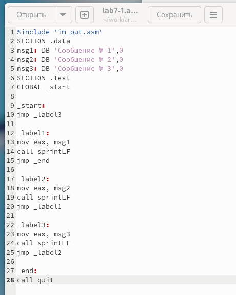{ #fig:005 width=70%, height=70% }

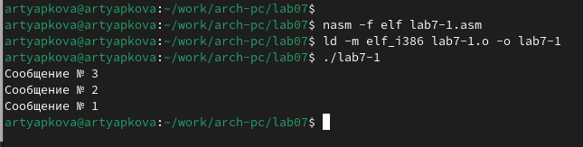{ #fig:006 width=70%, height=70% }

Инструкция `jmp` всегда выполняет переход, но в программах часто нужно делать условные переходы, когда действие зависит от выполнения условия. Рассмотрим пример с определением наибольшего числа из трех: A, B и C. Значения A и C заданы в программе, B вводится с клавиатуры.

Скомпилировала исполняемый файл и протестировала для разных значений B.

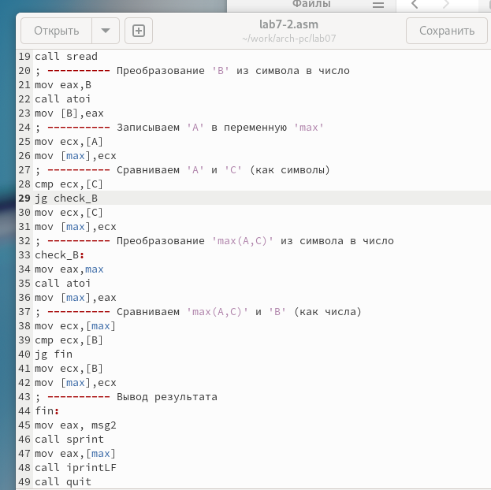{ #fig:007 width=70%, height=70% }

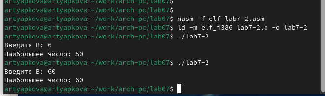{ #fig:008 width=70%, height=70% }

## Изучение структуры файла листинга

NASM обычно создает только объектный файл, но с ключом `-l` можно получить файл листинга.

Создала файл листинга для программы из lab7-2.asm.

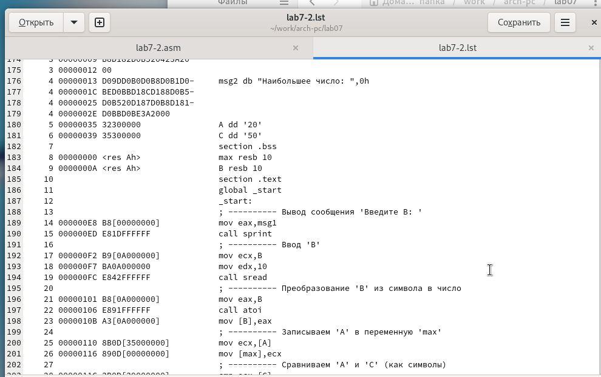{ #fig:009 width=70%, height=70% }

Изучила содержимое файла листинга. Приведу пример трех строк:

**Строка 203**

* **28** - номер строки
* **0000011C** - адрес
* **3B0D[39000000]** - машинный код
* **cmp ecx,[C]** - команда сравнения регистров `ecx` и переменной `C`

**Строка 204**

* **29** - номер строки
* **00000122** - адрес
* **7F0C** - машинный код
* **jg check_B** - условный переход к метке `check_B`, если `>`.

**Строка 205**

* **30** - номер строки
* **00000124** - адрес
* **8B0D[39000000]** - машинный код
* **mov ecx,[C]** - копирует значение `C` в `ecx`

Открыла lab7-2.asm, удалила операнд в инструкции с двумя операндами, выполнила трансляцию и получила файл листинга с ошибкой.

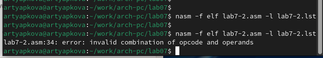{ #fig:010 width=70%, height=70% }

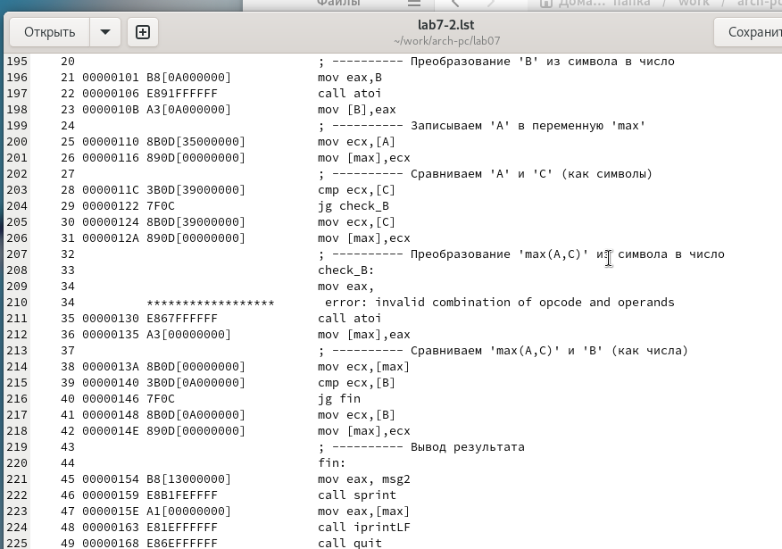{ #fig:011 width=70%, height=70% }

Объектный файл не создался, но в листинге видно место ошибки.

## Задание для самостоятельной работы

**Задание 1:** Написать программу нахождения наименьшей из трех целых чисел a, b и c. Значения выбрать из таблицы 7.5 по варианту 10: 41, 62, 35. Скомпилировать и проверить программу.

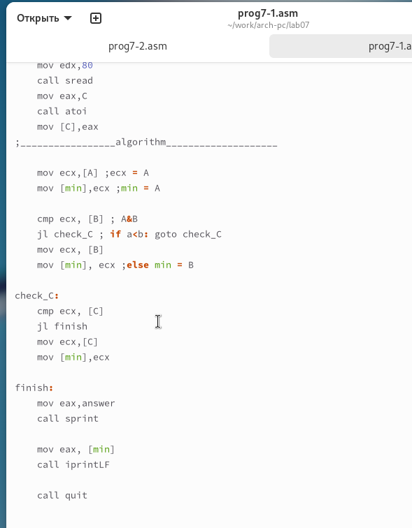{ #fig:012 width=70%, height=70% }

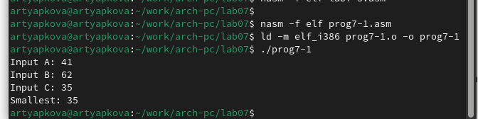{ #fig:013 width=70%, height=70% }

**Задание 2:** Написать программу, которая вычисляет значение функции f(x) для введенных с клавиатуры значений x и a. Формулу f(x) выбрать из таблицы 7.6 для варианта 10:
$$
 \begin{cases}
	x-2, x > 2
	\\   
	3a, x \le 2
 \end{cases}
$$

Скомпилировать и протестировать для значений из таблицы.

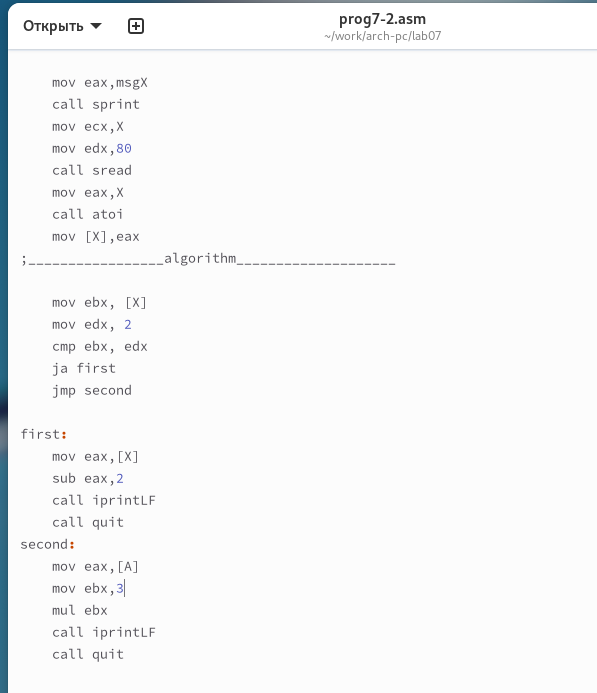{ #fig:014 width=70%, height=70% }

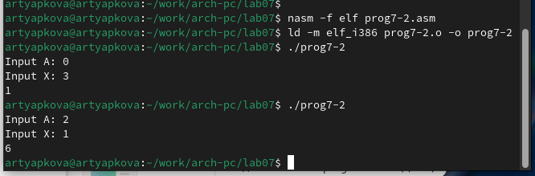{ #fig:015 width=70%, height=70% }

# Выводы

Изучили команды условного и безусловного переходов, познакомились с фалом листинга.