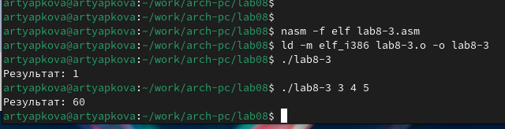

---
## Front matter
title: "Отчёт по лабораторной работе 8"
subtitle: "дисциплина: Архитектура компьютера"
author: "Тяпкова Альбина НММбд-04-24"

## Generic otions
lang: ru-RU
toc-title: "Содержание"

## Bibliography
bibliography: bib/cite.bib
csl: pandoc/csl/gost-r-7-0-5-2008-numeric.csl

## Pdf output format
toc: true # Table of contents
toc-depth: 2
lof: true # List of figures
lot: true # List of tables
fontsize: 12pt
linestretch: 1.5
papersize: a4
documentclass: scrreprt
## I18n polyglossia
polyglossia-lang:
  name: russian
  options:
	- spelling=modern
	- babelshorthands=true
polyglossia-otherlangs:
  name: english
## I18n babel
babel-lang: russian
babel-otherlangs: english
## Fonts
mainfont: PT Serif
romanfont: PT Serif
sansfont: PT Sans
monofont: PT Mono
mainfontoptions: Ligatures=TeX
romanfontoptions: Ligatures=TeX
sansfontoptions: Ligatures=TeX,Scale=MatchLowercase
monofontoptions: Scale=MatchLowercase,Scale=0.9
## Biblatex
biblatex: true
biblio-style: "gost-numeric"
biblatexoptions:
  - parentracker=trueЗырянов Артём Алексеевич	НБИбд-01-22

  - backend=biber
  - hyperref=auto
  - language=auto
  - autolang=other*
  - citestyle=gost-numeric
## Pandoc-crossref LaTeX customization
figureTitle: "Рис."
tableTitle: "Таблица"
listingTitle: "Листинг"
lofTitle: "Список иллюстраций"
lotTitle: "Список таблиц"
lolTitle: "Листинги"
## Misc options
indent: true
header-includes:
  - \usepackage{indentfirst}
  - \usepackage{float} # keep figures where there are in the text
  - \floatplacement{figure}{H} # keep figures where there are in the text
---

# Цель работы

Целью работы является приобретение навыков написания программ с использованием циклов и обработкой аргументов командной строки..

# Выполнение лабораторной работы

## Реализация циклов в NASM

Создала каталог для программ лабораторной работы №8 и файл `lab8-1.asm`.

При реализации циклов в NASM с использованием инструкции `loop` необходимо помнить, 
что эта инструкция использует регистр `ecx` в качестве счётчика, уменьшая его значение на единицу на каждом шаге. 
В качестве примера была написана программа, которая выводит значение регистра `ecx`.

Ввела в файл `lab8-1.asm` текст программы из листинга 8.1, создала исполняемый файл и проверила его работу.

{ #fig:001 width=70%, height=70% }

{ #fig:002 width=70%, height=70% }

Данный пример показал, что изменение регистра `ecx` в теле цикла `loop` может привести к некорректной работе программы. Изменила текст программы, добавив изменение значения регистра `ecx` в цикле.

В новой версии программа запускает бесконечный цикл при нечётном `N` и выводит только нечётные числа при чётном `N`.

{ #fig:003 width=70%, height=70% }

{ #fig:004 width=70%, height=70% }

Чтобы использовать регистр `ecx` в цикле и сохранить корректность работы программы, добавила команды `push` и `pop` для сохранения значения счётчика цикла `loop` в стеке. Внесённые изменения позволили программе корректно выводить числа от `N-1` до `0`, при этом количество проходов цикла соответствует значению `N`.

{ #fig:005 width=70%, height=70% }

{ #fig:006 width=70%, height=70% }

## Обработка аргументов командной строки

Создала файл `lab8-2.asm` в каталоге `~/work/arch-pc/lab08` и ввела в него текст программы из листинга 8.2.

Собрала исполняемый файл и запустила его с несколькими аргументами. Программа успешно обработала 5 аргументов, которые считаются словами/числами, разделёнными пробелами.

{ #fig:007 width=70%, height=70% }

{ #fig:008 width=70%, height=70% }

Написала ещё одну программу, которая вычисляет сумму чисел, переданных в программу как аргументы командной строки.

{ #fig:009 width=70%, height=70% }

{ #fig:010 width=70%, height=70% }

Изменила текст программы из листинга 8.3, добавив вычисление произведения аргументов командной строки.

{ #fig:011 width=70%, height=70% }

{ #fig:012 width=70%, height=70% }

## Задание для самостоятельной работы

Написала программу, которая вычисляет сумму значений функции $f(x)$ для $x = x_1, x_2, \dots, x_n$. 
Аргументы передаются через командную строку. Вид функции $f(x)$ взят из таблицы 8.1 в соответствии с вариантом, полученным на лабораторной работе №7.

Для варианта 10 выбрана функция $f(x) = 5(2 + x)$.

{ #fig:013 width=70%, height=70% }

Для проверки сначала запустила программу с одним аргументом. Например, $f(0) = 5 \cdot 2 = 10$, $f(1) = 5 \cdot 3 = 15$.

Затем запустила программу с несколькими аргументами и проверила сумму значений функции.

{ #fig:014 width=70%, height=70% }

# Выводы

Освоили работы со стеком, циклом и аргументами на ассемблере nasm.