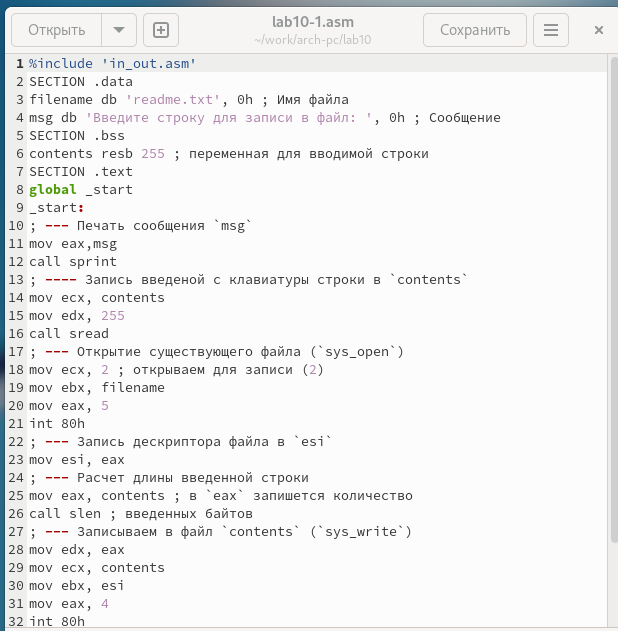
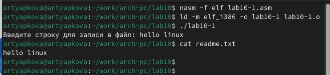
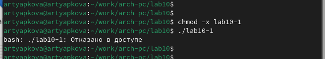
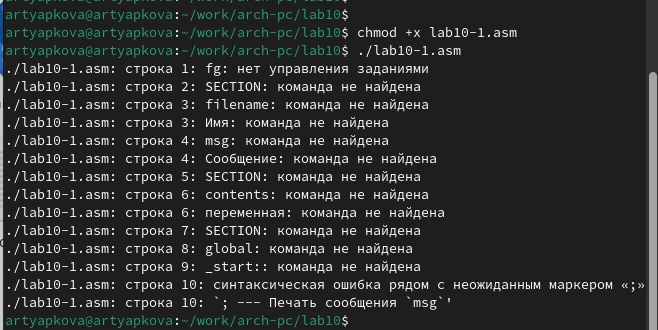
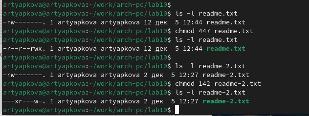
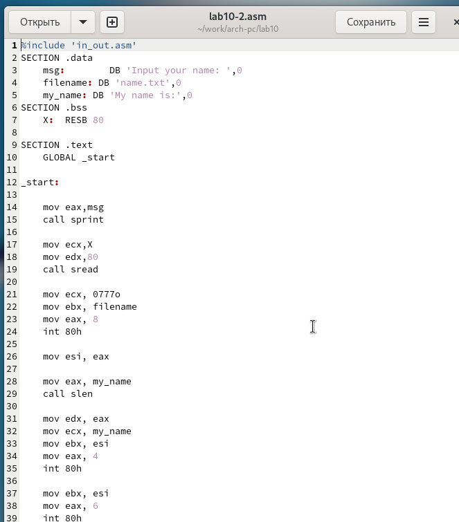
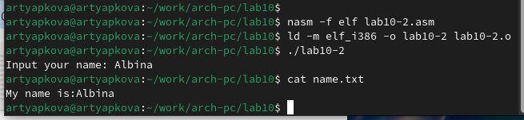

---
## Front matter
title: "Отчёт по лабораторной работе 10"
subtitle: "дисциплина: Архитектура компьютера"
author: "Тяпкова Альбина НММбд-04-24"

## Generic otions
lang: ru-RU
toc-title: "Содержание"

## Bibliography
bibliography: bib/cite.bib
csl: pandoc/csl/gost-r-7-0-5-2008-numeric.csl

## Pdf output format
toc: true # Table of contents
toc-depth: 2
lof: true # List of figures
lot: true # List of tables
fontsize: 12pt
linestretch: 1.5
papersize: a4
documentclass: scrreprt
## I18n polyglossia
polyglossia-lang:
  name: russian
  options:
	- spelling=modern
	- babelshorthands=true
polyglossia-otherlangs:
  name: english
## I18n babel
babel-lang: russian
babel-otherlangs: english
## Fonts
mainfont: PT Serif
romanfont: PT Serif
sansfont: PT Sans
monofont: PT Mono
mainfontoptions: Ligatures=TeX
romanfontoptions: Ligatures=TeX
sansfontoptions: Ligatures=TeX,Scale=MatchLowercase
monofontoptions: Scale=MatchLowercase,Scale=0.9
## Biblatex
biblatex: true
biblio-style: "gost-numeric"
biblatexoptions:
  - parentracker=true
  - backend=biber
  - hyperref=auto
  - language=auto
  - autolang=other*
  - citestyle=gost-numeric
## Pandoc-crossref LaTeX customization
figureTitle: "Рис."
tableTitle: "Таблица"
listingTitle: "Листинг"
lofTitle: "Список иллюстраций"
lotTitle: "Список таблиц"
lolTitle: "Листинги"
## Misc options
indent: true
header-includes:
  - \usepackage{indentfirst}
  - \usepackage{float} # keep figures where there are in the text
  - \floatplacement{figure}{H} # keep figures where there are in the text
---

# Цель работы

Целью работы является приобретение навыков написания программ для работы с файлами.

# Выполнение лабораторной работы

Создала каталог для программ лабораторной работы № 10, перешла в него и создала файлы `lab10-1.asm`, `readme-1.txt` и `readme-2.txt`.

В файл `lab10-1.asm` записала текст программы из листинга 10.1 (Программа записи сообщения в файл). Создала исполняемый файл и проверила его работу.

{ #fig:001 width=70%, height=70% }

Программа запрашивает строку и перезаписывает её в файл `readme.txt`. Если файла нет, то строка никуда не запишется.

{ #fig:002 width=70%, height=70% }

С помощью команды `chmod` изменила права доступа к исполняемому файлу `lab10-1`, запретив его выполнение. Попыталась выполнить файл. 

Файл не запускается, так как атрибут `x` снят во всех трёх позициях.

{ #fig:003 width=70%, height=70% }

С помощью команды `chmod` изменила права доступа к файлу `lab10-1.asm` с исходным текстом программы, добавив права на исполнение. Попыталась выполнить его.

Файл запускается, и терминал пытается выполнить его содержимое как консольные команды. Поскольку инструкции ассемблера не являются командами терминала, появляются ошибки. Тем не менее, если в такой файл записать команды терминала, их можно будет выполнить путём запуска файла.

{ #fig:004 width=70%, height=70% }

Установила права доступа к файлам `readme` в соответствии с вариантом из таблицы 10.4. Проверила правильность выполнения с помощью команды `ls -l`.

Для варианта 10: ```r-- r-- rwx``` и ```001 100 010```

{ #fig:005 width=70%, height=70% }

## Задание для самостоятельной работы

Написала программу, работающую по следующему алгоритму:

* вывести приглашение: “Как Вас зовут?”;
* ввести с клавиатуры свои фамилию и имя;
* создать файл с именем `name.txt`;
* записать в файл сообщение: “Меня зовут”;
* дописать в файл строку, введённую с клавиатуры;
* закрыть файл.

{ #fig:006 width=70%, height=70% }

{ #fig:007 width=70%, height=70% }

# Выводы

В ходе выполнения лабораторной работы я освоила работу с файлами и управление правами доступа.
